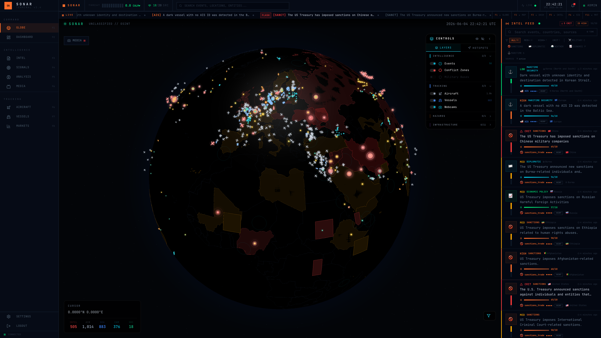
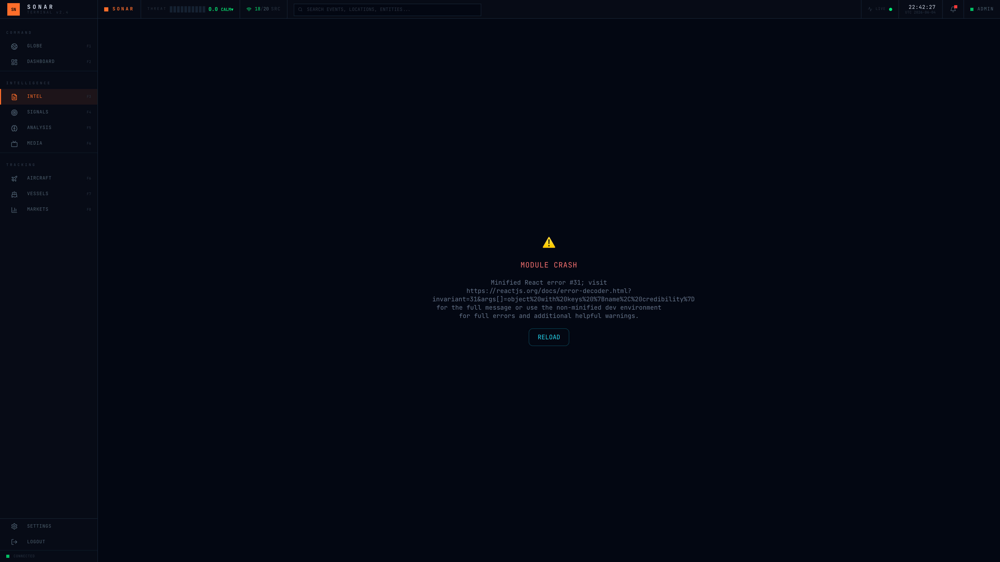
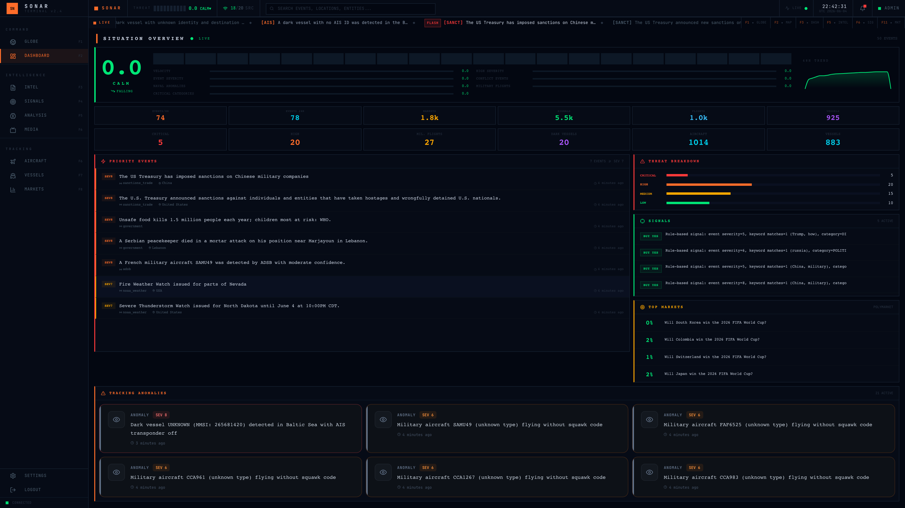

<div align="center">

# SONAR

### Real-time Geopolitical Intelligence Terminal

**Open-source OSINT platform** aggregating 20+ live sources, rendering events on a 3D globe, generating trading signals correlated to Polymarket prediction markets, and streaming real-time alerts.

[](https://opensource.org/licenses/MIT)
[](https://www.python.org/)
[](https://www.typescriptlang.org/)
[](https://reactjs.org/)
[](https://fastapi.tiangolo.com/)
[](https://docs.docker.com/compose/)
[](https://www.postgresql.org/)
[](https://github.com/soclosesociety/sonar/stargazers)

[Quick Start](#-quick-start) · [Features](#-features) · [Architecture](#-architecture) · [Configuration](#-configuration) · [Contributing](#-contributing)

</div>

---

## Screenshots

> Screenshots live in [`docs/screenshots/`](docs/screenshots/). Drop the app in your browser at `http://localhost:8090` once installed.

| 3D Globe — live events | Intel Feed — real-time | Dashboard — tension + signals |
|---|---|---|
|  |  |  |

---

## Features

- **20+ live intelligence sources**: 80+ RSS feeds, GDELT, Twitter (60+ accounts), Telegram (38+ channels), OpenSky flights, AISstream vessels, USGS earthquakes, NOAA weather, NASA FIRMS fires, ACLED conflicts, Reddit OSINT, government feeds, cyber threats, Shodan, Polymarket, YouTube live news, webcams
- **3D real-time globe** (Three.js + react-globe.gl) with events, flights, vessels, hazards, sensitive zones
- **Trading signals** auto-generated from event/market correlation with Polymarket prediction markets
- **LLM-powered analysis** via Ollama (local, free) with rule-based keyword fallback
- **Real-time streaming** via Socket.IO + Server-Sent Events
- **Web3 + email auth** (JWT, bcrypt, ethers.js wallet sign)
- **Telegram bot** for alerts and administration
- **Tension scoring** with 48-hour history and per-region heatmaps
- **Anomaly detection** on flight/vessel patterns near sensitive zones

---

## Quick Start

### Prerequisites

- Docker & Docker Compose (Docker Desktop on Mac/Windows, or Docker Engine on Linux)
- 4 GB free RAM, 30 GB free disk

### Install in 3 commands

```bash
git clone https://github.com/soclosesociety/sonar.git
cd sonar
cp .env.example .env
```

Edit `.env` — at minimum, generate strong secrets:

```bash
openssl rand -hex 32  # → paste as SECRET_KEY
openssl rand -hex 32  # → paste as JWT_SECRET
```

Then:

```bash
docker compose up -d
```

Wait ~30 s for containers to become healthy:

```bash
docker compose ps
# All 5 services should show "healthy"
```

Open **http://localhost** in your browser (nginx is on port 80 by default; if it's taken, see [Port conflicts](#port-conflicts) below).

### First login

The app has no default admin account — register your first user via the UI (`/register`). The first user does *not* automatically become admin; promote them by hand:

```bash
docker compose exec postgres \
  psql -U sonar -d sonar -c "UPDATE users SET role='admin' WHERE email='you@example.com';"
```

### Port conflicts

If ports 80, 3000, 5432, 6379, or 8001 are already in use, create `docker-compose.override.yml`:

```yaml
services:
  postgres: { ports: !override ["5435:5432"] }
  redis:    { ports: !override ["6383:6379"] }
  backend:  { ports: !override ["8003:8000"] }
  nginx:    { ports: !override ["8090:80"] }
```

Then `docker compose up -d`. The app is at **http://localhost:8090**.

---

## Architecture

```
┌─────────┐     ┌──────────┐     ┌────────────┐
│  nginx  │────▶│ frontend │     │  postgres  │
│  :80    │     │  :3000   │     │  :5432     │
└─────────┘     └──────────┘     │  +PostGIS  │
                                 └─────┬──────┘
┌──────────────────────────────────────┤
│           backend :8000              │
│  ┌────────────┐  ┌──────────────┐   │
│  │ Ingestion  │  │  Analyzer    │   │
│  │ 20 sources │  │  Pipeline    │   │
│  └─────┬──────┘  └──────┬───────┘   │
│        │    ┌────────┐   │           │
│        └───▶│ Redis  │◀──┘           │
│             │ :6379  │               │
│             └────────┘               │
└──────────────────────────────────────┘
```

### Tech stack

| Layer | Stack |
|---|---|
| Backend | Python 3.12 · FastAPI 0.115 · SQLAlchemy 2 (async) + GeoAlchemy2 · Alembic |
| Frontend | React 18 · TypeScript 5.6 · Vite 6 · Tailwind 3 · Zustand 5 |
| 3D / Maps | Three.js · react-globe.gl · MapLibre GL · Recharts |
| Realtime | Socket.IO · Server-Sent Events |
| Database | PostgreSQL 16 + PostGIS 3.4 |
| Cache | Redis 7 |
| LLM | Ollama (llama3.2:3b) — local, free, no API key |
| Auth | JWT (python-jose) · bcrypt · ethers.js (Web3 wallet) |
| Container | Docker Compose (5 services) |

### Data flow

`IngestionManager._process_event` → `AnalysisPipeline.process` → `RuleBasedSignalGenerator.generate` → Postgres + Redis → Socket.IO/SSE → Frontend stores → UI components.

---

## Configuration

Every setting lives in `.env`. The full list is documented in [.env.example](.env.example).

### Required

- `SECRET_KEY`, `JWT_SECRET` — generate with `openssl rand -hex 32`
- `POSTGRES_PASSWORD` — strong password (default rejects in production)

### Recommended (free API keys)

| Source | Where to get a key |
|---|---|
| OpenSky (flights) | https://opensky-network.org/register |
| AISstream (vessels) | https://aisstream.io |
| NASA FIRMS (fires) | https://firms.modaps.eosdis.nasa.gov/api/area/ |
| Windy (webcams) | https://api.windy.com |
| ACLED (conflicts) | https://acleddata.com/register |
| Shodan | https://account.shodan.io |
| Twitter | https://developer.twitter.com |
| YouTube | https://console.cloud.google.com (Data API v3) |

All sources have graceful fallbacks — the app works with **zero API keys**, just with less data.

### LLM (local, free)

Install [Ollama](https://ollama.com), then pull a model:

```bash
ollama pull llama3.2:3b
```

The backend talks to Ollama at `http://host.docker.internal:11434` by default. If Ollama is down, the analyzer falls back to keyword-based severity estimation — the app keeps working.

### Tuning thresholds

```bash
SIGNAL_MIN_CONFIDENCE=0.45  # raise to be stricter on trading signals
MISPRICING_MIN_PCT=5        # min % edge to consider a Polymarket mispricing
ALERT_MIN_SEVERITY=6        # 1–10
SCAN_INTERVAL_SECONDS=120   # ingestion cycle (lower = more pressure on sources)
```

---

## Developer workflow

```bash
# Hot-reload mode (Vite + uvicorn --reload)
make dev

# Logs
make logs              # all containers
make logs-backend      # backend only

# Tests (13 integration tests)
docker compose exec backend pytest tests/test_api.py -v

# Frontend type check / build
cd frontend && npx tsc --noEmit
cd frontend && npx vite build

# Database
make db-shell                       # psql
make migrate                        # alembic upgrade head
make migration msg="add foo column" # alembic autogenerate
```

### Project structure

```
sonar/
├── backend/             # FastAPI app
│   ├── app/
│   │   ├── api/         # REST routers (auth, events, markets, signals, …)
│   │   ├── analyzer/    # Pipeline + signal generators
│   │   ├── ingestion/   # 20 source modules
│   │   ├── auth/        # JWT + wallet + rate limiting
│   │   ├── models/      # SQLAlchemy ORM
│   │   ├── polymarket/  # Market tracker + opportunity engine
│   │   └── telegram_bot/
│   ├── alembic/         # DB migrations
│   └── tests/           # pytest integration tests
├── frontend/
│   └── src/
│       ├── components/  # Globe, dashboard, feed, layout…
│       ├── pages/       # Login, Intel, Analysis, Settings…
│       ├── stores/      # Zustand state
│       ├── hooks/       # useWebSocket, etc.
│       └── services/    # API + socket clients
├── data/                # Static reference data (geojson, keywords)
├── nginx/               # Reverse proxy config
└── docker-compose.yml
```

---

## Security

- **Always change `SECRET_KEY`, `JWT_SECRET`, and `POSTGRES_PASSWORD`** before deploying anywhere reachable
- Login is rate-limited (8 attempts / 5 min per IP+email)
- Registration is rate-limited (5 / hour per IP)
- Webcam thumbnail proxy disables redirects to prevent SSRF
- Bearer-token auth (JWT) — frontend stores token in localStorage, server validates per request
- Admin endpoints (`/settings`, `/signals/regenerate`, …) require role=admin

Report vulnerabilities via [SECURITY.md](SECURITY.md).

---

## Contributing

Pull requests, issues, and discussions are very welcome. Read [CONTRIBUTING.md](CONTRIBUTING.md) first.

Good first issues are tagged [`good first issue`](https://github.com/soclosesociety/sonar/labels/good%20first%20issue).

---

## License

[MIT](LICENSE) — use it, fork it, ship it.

---

<div align="center">

Built with care by [**SoCloseSociety**](https://github.com/soclosesociety) · contributions welcome 🌍

</div>
